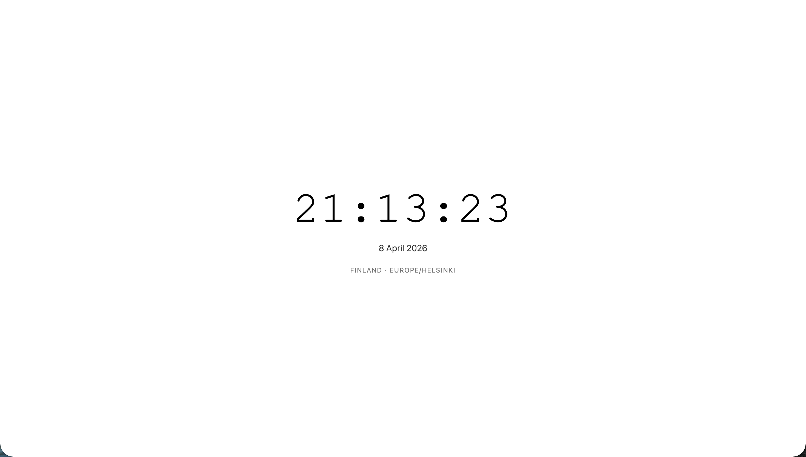

# Ansible Role: lada-xray-clock-deploy

---

## ⚠️ DISCLAIMER

This project is intended **exclusively** for displaying the current time on a **Lada XRAY** infotainment system. It is **NOT** a network tunneling tool, proxy, censorship circumvention utility, or any form of traffic obfuscation software. The name "XRAY" refers solely to the **Lada XRAY automobile** manufactured by AvtoVAZ.

**Use of this software for bypassing network restrictions is strictly prohibited and not supported.**

---

## Purpose

Deploys a minimal static HTML clock to a Lada XRAY head unit via Ansible.



---

## Problem Solved

The Lada XRAY factory clock:
- Drifts over time
- Does not adjust automatically for DST

This role provides a **local, offline HTML page** displaying accurate **Europe/Helsinki** time, accessible via the car's browser.

---

## Features

- **Single-file HTML clock** — no external assets or network requests
- **Europe/Helsinki timezone** — handles EET/EEST DST automatically
- **High-contrast, distraction‑free UI** — large digits, black on white
- **Ansible‑managed deployment** — idempotent, repeatable
- **Minimal storage footprint** — under 4 KB

---

## Requirements

- Ansible control node
- Access to Lada XRAY infotainment filesystem (SSH/USB/SD)

---

## Quick start

- need vm with ubuntu 24.04 and resources 1 vCPU and 2 Gb memory
- on local machine: linux, python3.11+, poetry

```
1. clone repository on local machine
2. provide ssh key to remote server
3. update variables in playbooks/whattimeisnow.yml
4. install deps and activate venv
5. apply playbook
```

Once all required actions are complete, check your domain.
It should redirect to HTTPS and display the current time in Helsinki.

---

## License

**© PivLab Space** — All rights reserved.
